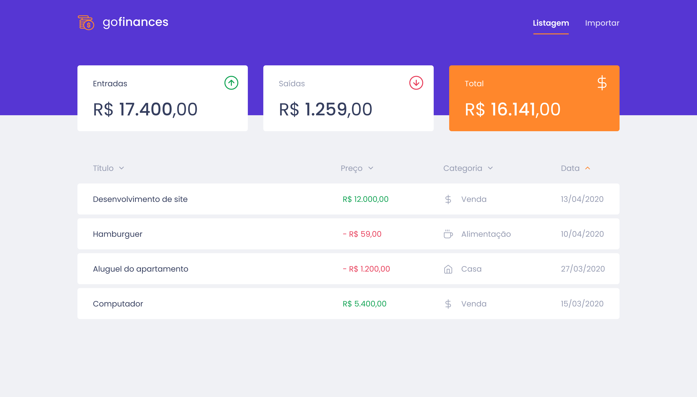
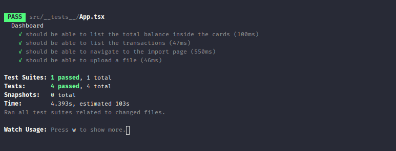

  

  <h3 align="center">
    Desafio 07: GoFinances Web
  </h3>

# Sobre o desafio

Desafio feito em relação ao esperado em **[Desafio 07](https://github.com/Rocketseat/bootcamp-gostack-desafios/tree/master/desafio-fundamentos-reactjs)**.

Neste desafio fora implementado:

- requisição a api;
- listagem do balance;
- listagem das transações;
- direcionamento entre páginas (Listagem/Importar);
- importação de csv.

## Como executar este Projeto?

Antes de tudo, é necessário ter acesso a api deste projeto, presente em **[Bootcamp-Desafio-06-Fundamentos-Node.js-Database-e-Upload-](https://github.com/PatrickMendC/Bootcamp-Desafio-06-Fundamentos-Node.js-Database-e-Upload-)** e a ter estartado. O próximo passo é clonar este projeto e seguir os comandos:

```
yarn
yarn start
```

Pronto, projeto está funcionando!

## Como o desafio foi feito

- **`Formatando os valores de moeda`**

Função feita para, ao receber um valor como argumento, o transformar e retornar em uma string no formato de moeda do Brasil. Presente em `./src/utils/formatValue` e importada em `src/pages/Dashboard/index.tsx`.

```javascript
const formatValue = (value: number): string =>
  Intl.NumberFormat('pt-BR', {
    style: 'currency',
    currency: 'BRL',
  }).format(value);

export default formatValue;
```

- **`Requisição da api e armazenamento em estado`**

Requisição a api, com posterior formatação de dados e armazenamento em estado da aplicação.

Dentro de `src/pages/Dashboard/index.tsx` temos:

```javascript
const [transactions, setTransactions] = useState<Transaction[]>([]);
  const [balance, setBalance] = useState<Balance>({} as Balance);

  useEffect(() => {
    async function loadTransactions(): Promise<void> {
      const response = await api.get('/transactions');

      const transactionsFormatted = response.data.transactions.map(
        (transaction: Transaction) => ({
          ...transaction,
          formattedValue: formatValue(transaction.value),
          formattedDate: new Date(transaction.created_at).toLocaleDateString(
            'pt-BR',
          ),
        }),
      );

      const balanceFormatted: Balance = {
        income: formatValue(response.data.balance.income),
        outcome: formatValue(response.data.balance.outcome),
        total: formatValue(response.data.balance.total),
      };

      setTransactions(transactionsFormatted);
      setBalance(balanceFormatted);
    }

    loadTransactions();
  }, []);
```

No código acima o `useEffect` tem o objetivo de receber as transações cada vez que a aplicação é recarregada. Nela, é acessado `/transactions` da api, que trás um objeto contendo um array de transactions, e um objeto de balance.

Na constante `transactionsFormatted` temos o mapeamento de cada transaction, onde adicionamos tudo o que ela já tem `...transaction`, e adicionamos novos campos, com valores formatados, respectivameente `formattedValue` e `formattedDate`.

Na constante `balanceFormatted` temos somente a conversão do balance vindo da api, em um objeto contendo os mesmos atributos, agora transformados em string.

No fim, ambas as constantes tem seus valores setados no estado da aplicação.

- **`listagem do balance`**

Em `src/pages/Dashboard/index.tsx` temos o seguinte código:

```javascript
// código anterior
<Card>
  <header>
    <p>Saídas</p>
    
  </header>
  <h1 data-testid="balance-outcome">{balance.outcome}</h1>
</Card>
// código posterior
```

Neste temos a disponibilização do valor do `balance.outcome` diretamente como filho do `h1`, este mesmo uso se repete para os demais atributos do balance, antes e após o código acima.

- **`listagem de transactions`**

Em `src/pages/Dashboard/index.tsx` temos o seguinte código de listagem de transactions:

```javascript
// código anterior
{
  transactions.map(transaction => (
    <tr>
      <td className="title">{transaction.title}</td>
      <td className={transaction.type}>
        {transaction.type === 'outcome' ? '- ' : ''}
        {transaction.formattedValue}
      </td>
      <td>{transaction.category.title}</td>
      <td>{transaction.formattedDate}</td>
    </tr>
  ));
}
// código posterior
```

No código acima, as transactions passam por um map, que irá retornar individualmente uma `<tr> TODO </tr>` para cada transaction armazenada. Assim como, suprir esta `<tr>` de informações. Vide `{transaction.title}` que retorna o titulo da transaction.

- **`direcionamento entre páginas`**

Para poder acessar as páginas de <strong>Listagem/Importar</strong>, é necessário o uso de `Link` no cabeçalho, de forma a mudar entre elas de forma padrão de acordo com o `react-router-dom`. Para isso, é só adicionar as tags de Link em `src/components/Header`, como visto abaixo:

```javascript
// codigo anterior
<nav>
  <Link to="/">Listagem</Link>
  <Link to="/import">Importar</Link>
</nav>
// codigo posterior
```

## Rodando testes

Para esse projeto atender o desafio proposto, é necessário, além do correto preenchimento do mesmo, este passar nos seguintes testes:

- **`should be able to list the total balance inside the cards`**: Para que esse teste passe, sua aplicação deve permitir que seja exibido na sua Dashboard, cards contendo o total de `income`, `outcome` e o total da subtração de `income - outcome` que são retornados pelo balance do seu backend.

* **`should be able to list the transactions`**: Para que esse teste passe, sua aplicação deve permitir que sejam listados dentro de uma tabela, toda as transações que são retornadas do seu backend. Transações do tipo `outcome` devem exibir os valores no formado `- R$ 5.500,00`.

- **`should be able to navigate to the import page`**: Para que esse teste passe, você deve permitir a troca de página através do Header, pelo botão que contém o nome `Importar`.

- **`should be able to upload a file`**: Para que esse teste passe, você deve permitir que um arquivo seja enviado através do componente de drag-n-drop na página de `import`, e que seja possível exibir o nome do arquivo enviado para o input.

Por fim, para rodar o teste:

```
yarn test
```

Resultado esperado:

<p align="center">
  
</p>

## Para Mais Detalhes

Para mais detalhes a respeio do desafio, checar página oficial do mesmo em **[Desafio 07](https://github.com/Rocketseat/bootcamp-gostack-desafios/tree/master/desafio-fundamentos-reactjs)**.

